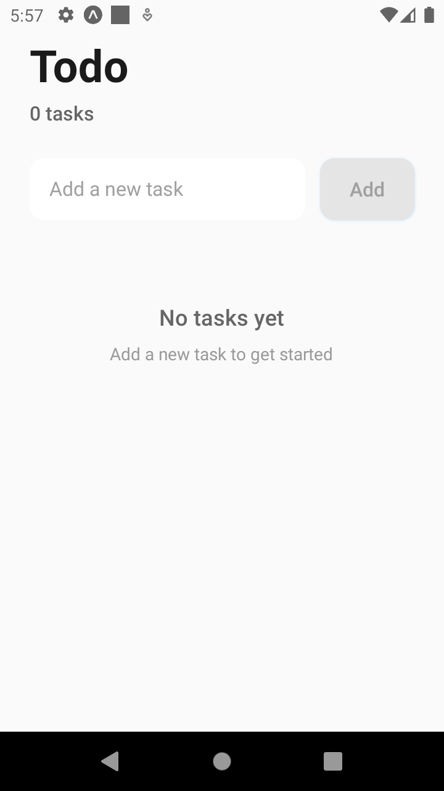
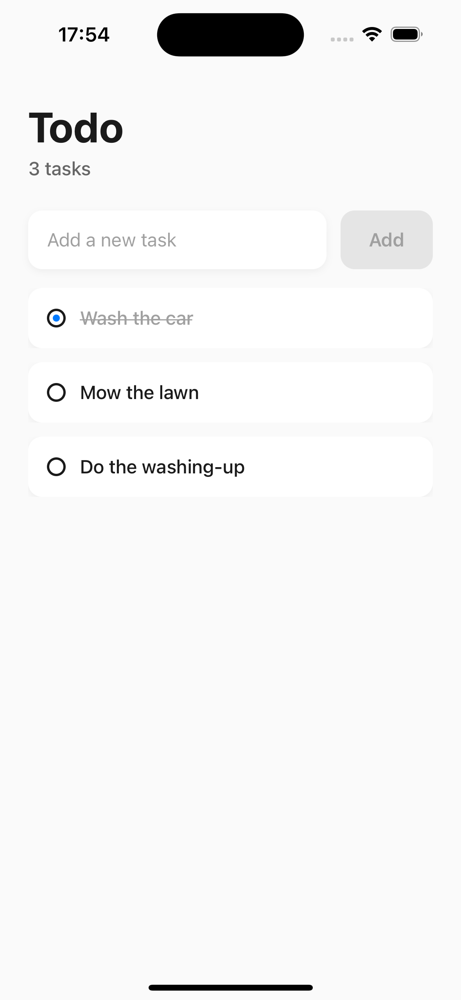

# Todo App with Expo and React Native

This project is a simple To-Do List application built with Expo and React Native. It allows users to create, toggle, and delete tasks with a smooth, animated user interface. Key features include task swipe actions, animations for task addition, and a responsive design for both iOS and Android.

# Features

- [x] Add Tasks: Users can add tasks by entering text into the input field.
- [x] Complete Tasks: Tap on any task to toggle its completion status.
- [x] Swipe to Delete: Swipe left on any task to reveal a delete button.
- [x] Animations: Each new task fades in with a sliding animation.
- [x] Keyboard Handling: The keyboard is dismissed automatically after adding a task.

# Installation

### Prerequisites

Ensure that you have the following installed:

Node.js: Download and install from nodejs.org
Expo CLI: Install globally by running npm install -g expo-cli
Yarn (optional but recommended): Install globally by running npm install -g yarn

# Steps

## Clone the repository:

```console
git clone https://link/todos.git
cd todos
```

## Install dependencies:

```console
npm install
```

## Start the app:

```console
expo start
```

### Use the Expo Go app on your phone to scan the QR code and run the app on a physical device, or launch an emulator.

# Technologies Used:

Expo, react-native-reanimated, @testing-library/react-native

## Core Technologies

- Expo: Version ~52.0.11.
- React: Version 18.3.1.
- React Native: Version 0.76.3.

## Key Libraries

- react-native-gesture-handler: Version ~2.20.2. A library that enables handling complex touch gestures such as swipe-to-delete.
- react-native-reanimated: Version ~3.16.1. A powerful library for animations, allowing smooth UI transitions and effects.

## Testing Tools

- Jest: Version ^29.7.0. A comprehensive testing framework that ensures the reliability of the app by running unit tests.
- @testing-library/react-native: Version ^12.8.1. Simplifies testing React Native components by providing utilities that encourage good testing practices.




